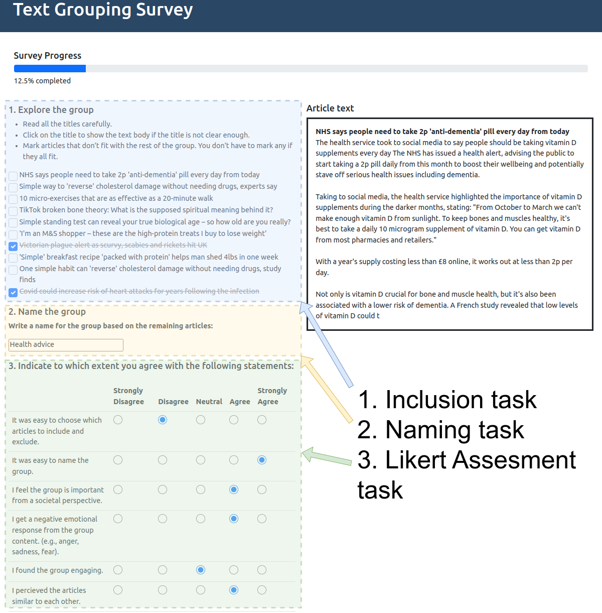

# CIPHE: Cluster Interpretation and Precision from Human Exploration

**CIPHE is a survey platform for collecting human interpretation data of document clusters. It is built on Django and contain metrics for calculating cluster precision and participant agreement. It can be hosted on a server to collect data from experts or crowdsourcing workers to gather data for human evaluation of document clusters.**

## Paper
This is the repository connected to the paper "CIPHE: A Framework for Cluster Interpretation and Precision from Human Exploration" presented at NLP4DH 2024.

## Setup
1. `Create venv with requirements.txt`
2. `./manage.py makemigrations`
3. `./manage.py migrate`
4. `./manage.py createsuperuser`
5. `./manage.py import_data data/data.json`
6. `./manage.py runserver`

A document in `data.json` should contain the fields `title`, `text` and `label`, where the label corresponds to cluster id. See `example_articles.json`.

#### Changing the Likert questions
To change the Likert questions, change the LikertScaleForm fields in `survey/forms.py`. Do not unnecessarily change the variable names as they are used in other parts of the framework. If needed then they need to be changed in other sections as well. Support for variable amount of questions will be added in the future.

## Usage
#### Survey
A User object is created for each user id string that is submitted on the welcome page. If a user already exists, their data is loaded. The user will be shown one cluster at a time from the survey. The survey/models.py holds the database models that make up the survey platform. In the django admin view, the imported documents should be showing up under Articles. Each Article is connected to a Cluster. The users taking the survey are connected to clusters through the Page object. The page also links to the objects that contain survey answers for a user such as `LikertScaleQuestion`, `NameQuestion`, and `TaxonomyQuestion`.

#### Analysis
The data is stored in db.sqlite3. 
* To get the CIPHE metrics for a survey and e.g. users 1, 2, and 42, run `./manage.py ciphe_metrics 1 2 42`.
* To inspect the responses from a single User, run `./manage.py print_answers_user 42`.
The functions for plotting can be found in `utils/plotting/` and the file `print_CIPHE.py`. To convert the database to a plottable file see `sql_to_json.py`.

### Linting
Please lint your code using "ruff"
* Install ruff: pip install ruff
* Format: ruff format survey
* Lint: ruff check survey --fix

#### Cite
Citing information found at:
[CIPHE: A Framework for Document Cluster Interpretation and Precision from Human Exploration](https://aclanthology.org/2024.nlp4dh-1.52) (Eklund et al., NLP4DH 2024)
